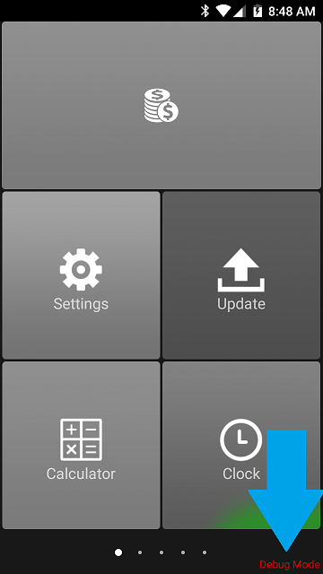

# Development Process

The development process is quite straightforward for developing solutions on the N-series devices. 

() = optional
[] = required

(Get Development/Debug Device) -> [Develop/Port Application] -> [Sign Release Application w/ Nexgo Provided Signature] -> [Distribute Application(s)]

## Table of Contents
* [Supported Android Versions](#supported-android-versions)
* [Basic Development Requirements](#basic-development-requirements)
* [Developer Mode / Debug Mode](#developer-mode-debug-mode)
  * [Release Mode](#release-mode)
  * [Debug Mode](#debug-mode)
* [Development Considerations](#development-considerations)
* [Software Updates + Distribution](#software-updates-distribution)
  * [Certificate](#certificate)
  * [Application Updates](#application-updates)

## Supported Android Versions
The Nexgo terminals run on a number of different versions of Android. They are listed below for reference:

| Device | Android Version |
| :--------------- | :--------------- |
| N3 | 5.1.1 |
| N5 | 5.1.1 |
| N5S | 7.0 |
| N6 | 7.0 |

## Basic Development Requirements
In order to get started developing applications on the Nexgo terminals, you will need the following items:

1. Nexgo POS Terminal in Debug Mode
2. Computer with Android Studio installed
3. Micro-USB cable (N5) or USB-C cable (N6)
4. ADB Drivers installed on the development machine

## Developer Mode / Debug Mode 
There is an important different between **DEBUG** Mode and **RELEASE** Mode Nexgo terminals. 

Devices in Debug Mode will display Debug Mode in red letters at the bottom right of the screen:

### Release Mode
1. Devices in *RELEASE MODE* can only install applications signed with a Nexgo provided key/signature. 
1. Devices in *RELEASE MODE* can not enable *Developer Mode / Tools* in Android Settings, and ADB is disabled at the system level. 

### Debug Mode
1. Devices in *DEBUG MODE* can install any signed / unsigned APK as long as it is compatible with the Android version running on the corresponding device. 
1. Devices in *DEBUG MODE* can enable *Developer Mode / Tools* in Android Settings. 
1. Devices in *DEBUG MODE* support and allow enabling ADB debugging on the terminal. 

> Terminals can **not** be changed from one 'mode' (i.e. RELEASE / DEBUG) to another remotely. Changing the device mode must be done at Nexgo's office by Nexgo staff. 

If you are ordering a unit to use for development, please be sure to note as such so that the team changes the device to debug mode before shipping it out. 

## When to use the SDK
If you are developing an application that *uses system functions such as printing or extracting the S/N* of the device - you will *need to import the NEXGO SDK libraries into your application*. These libraries are available in the root of this repository. 

If you are *not developing an application that uses system functions such as the integrated printer, etc.* - but are just *using standard Android functionality*, then you *do not need to import the NEXGO SDK* libraries. 

Please take into account the versions above to make sure your application functionality is supported on the devices above. 

## Development Considerations
While these devices are built using Android, they have been modified and hardened for use in the payment industry. Some considerations should be noted:
*  Google Play Services is *not* available on the devices. This includes both the Google App Store *and* the Play Services themselves. 
   * Application that rely on Play Services will need to make appropriate changes in order to function correctly on the devices. 
*  The devices cannot connect to 'open' and/or 'WEP' WIFI networks. Only WPA/WPA2 networks are supported. Enterprise WPA is supported as well.
*  Standard android NFC libraries may not function as intended on the devices. If you need to use NFC for reading Tags, EMV cards, etc. - there are hardened NEXGO libraries available for handling this. 
*  Development mode (i.e. 'Debug Mode') terminals can install any unsigned APK; however, Release Mode terminals will only install APKs signed with a valid key provided by NEXGO.
*  [Application distribution](#application-updates) needs to be taken into account. There are a few ways you can handle 
    *  Nexgo uses our 'XTMS' system to handle App, Certificate, and FW updates over-the-air to the terminals. 
	*  Alternatively, you can 'sideload' the FW/Certs/Apps using USB or an SD card - though this would not be ideal if you plan on changing the software on the device in the future (including updates).

## Software Updates + Distribution

### Certificate
As mentioned previously, all RELEASE/production terminals require applications to be signed with a Nexgo-provided key for the terminals to allow them to be installed onto them. These keys correspond to a unique certificate that is generated for each customer, and must also be installed *once* to the device. 

This certificate is generated/provided at the same time your Nexgo signing key is created. 

Usually, the certificate is installed when a terminal is initially deployed to a customer. After it is installed once, it does not need to be done again. Application installations/updates to the device will continue to reference that certificate when validating signatures during installation. 

> Certificates can only be installed using XTMS, or by manually installing them locally on the terminals. 

### Application Updates
Once an application is signed and ready for release to production terminals, there are a few methods that can be used to distribute the applications to terminals:
1. Use Nexgo's **XTMS** Update Services
   1. XTMS is Nexgo's solution for remotely updating terminals in the field with Application (APK), Certificate (Certs), and FW (OTA) updates. 
   1. All terminals bought from Nexgo will automatically check-in to XTMS in the following instances:
      1. Every time the terminal boots (and connects to network)
	  1. Once every 2 hours
	  1. Every time the terminal disconnects/reconnects to a network (WIFI/4G)
   1. Once the terminal checks-in, if there is an update pending/scheduled, the terminal will automatically download and install the update in the background (note: FW/Cert updates require a device reboot).
   1. After the update is done on the terminal, the terminal will report the result back to XTMS. 
   1. There is both a GUI and an API option available for managing terminals using XTMS. 
   1. All update plans are done on a S/N basis. 
1. Manually Sideload the application yourself
   1. Manually sideloading a signed application requires you to attach an external device (i.e. PC, SD card, USB stick) to the terminal, and then to manually install the APK by selecting the APK file in the file browser and following the standard Android Installation prompts. 
   1. This is more involved/labor-intensive than using XTMS, but for on-site updates or when only managing a small number of terminals this could work as a simple solution. 
1. Develop your own application distribution solutions
   1. Alternatively, instead of using XTMS or sideloading applications to the devices - you can create your own Update/Management solution.
   1. The SmartSDK (System SDK) provides a method for installaing APKs in the background without prompting the user. 
      1. The system will still check/validate the APK signatures on Production devices. 
   1. Using this method, you could develop your own app store or simple upgrade server. 

