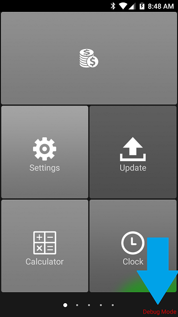

# Getting Started

In order to get started developing applications on the Nexgo terminals, you will need the following items:

1. Nexgo POS Terminal in Debug Mode 
2. Computer with Android Studio installed
3. Micro-USB cable (N5) or USB-C cable (N6)
4. ADB Drivers installed on the development machine

## Debug Mode Devices
Nexgo Android devices must be in Debug mode in order for rapid development using Android Studio, as only devices in Debug Mode with Developer Mode enabled will allow you to use the ADB connection. 

Devices in Debug Mode will display Debug Mode in red letters at the bottom right of the screen
